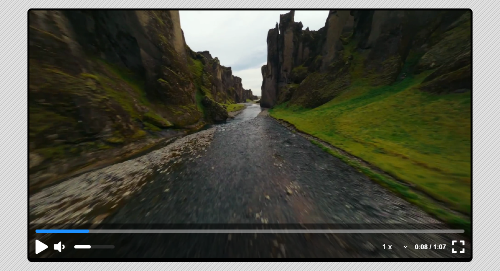

# 🎬 Video Player

A simple and custom HTML5 Video Player built using HTML, CSS, and JavaScript. This project allows users to play, pause, control volume, and seek through videos in a clean and responsive interface.

## 🔧 Features

- ▶️ Play & Pause functionality
- 🔊 Volume Control
- 🔘 Seek Bar (Progress Bar)
- ⏱️ Time Indicator (Current time / Duration)
- 📱 Responsive Design

## 📸 Preview



## 🛠️ Tech Stack

- HTML5
- CSS3
- JavaScript (Vanilla)

## 🚀 Getting Started

### 1. Clone the repository

```bash
git clone https://github.com/rayhan-fardous/video-player.git
```

### 2. Open in Browser

Just open the `index.html` file in your favorite browser.

---

## ✨ Customization

You can modify the video source in `index.html` by replacing:

```html
<video
  src="/assets/video/Beautiful Iceland Canyon.mp4"
  class="video"
  playsinline
></video>
```

Make sure the video file is placed in the correct directory or provide a valid video URL.

## 🙌 Credits

Created by [Rayhan Fardous](https://github.com/rayhan-fardous)
